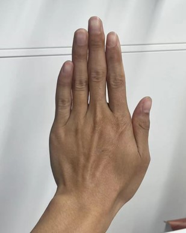

# 功能介绍

body_tracking package功能为控制机器人跟随人体运动。

订阅智能结果ai_msgs，运行策略，确定跟随track及移动目的位置。

通过发布消息直接控制机器人旋转和平移运动。

## 被跟随人体的选择

当启用唤醒手势时，识别到唤醒手势后，通过判断做手势的人手框是否在人体框内来确定跟随的人体。因此要求做唤醒手势时，人手需要在人体框内。

当未启用唤醒手势时，选择人体检测框宽度最大的人体作为被跟随人体。

已有跟随人体的情况下，其他人体不会触发机器人控制。

只有当被跟随人体消失时，才会重新寻找新的跟随人体。连续track_serial_lost_num_thr帧未检测到人体，判断人体消失，支持启动和运行时动态配置。

## 唤醒手势

唤醒手势用于唤醒机器人跟随人体的功能。

当启用唤醒手势时，机器人会跟随做了唤醒手势的人体。一般用于人较多，环境复杂的场景，通过启用唤醒手势避免误触发控制功能。

当未启用唤醒手势时，不会触发机器人跟随功能。

使用"OK"手势作为唤醒跟随手势，手势动作举例如下：


使用"Palm"手势作为取消跟随手势，取消后需要重新使用唤醒手势选择跟随人体。手势动作举例如下：



## 注意做唤醒或取消手势时，需要举起手（人手在人肩部以上）做手势，避免手势算法误报导致误唤醒/取消。 ##

## 控制策略

已找到被跟随人体后，对于每一帧输入的智能结果处理策略如下：

判断人体检测框中心点和机器人之间的角度，角度超过阈值（activate_robot_rotate_thr，支持启动和运行时动态配置）时，控制机器人旋转，保持被跟随人体在机器人正前方。

当被跟随人体消失时，停止机器人运动，并寻找新的被跟随人体。

当跟随人体在机器人正前方时，判断人体检测框上边界（检测框的top坐标），超过阈值（activate_robot_move_thr，支持启动和运行时动态配置）时，控制机器人运动。


# 编译

## 依赖库

ros package：

\- ai_msgs

ai_msgs为自定义的消息格式，用于算法模型推理后，发布推理结果，ai_msgs pkg定义在hobot_msgs中。

## 开发环境

\- 编程语言: C/C++

\- 开发平台: X3/X86

\- 系统版本：Ubuntu 20.0.4

\- 编译工具链:Linux GCC 9.3.0/Linaro GCC 9.3.0

## **编译**

 支持在X3 Ubuntu系统上编译和在PC上使用docker交叉编译两种方式。

### **Ubuntu板端编译**

1. 编译环境确认 
   - 板端已安装X3 Ubuntu系统。
   - 当前编译终端已设置TogetherROS环境变量：`source PATH/setup.bash`。其中PATH为TogetherROS的安装路径。
   - 已安装ROS2编译工具colcon，安装命令：`pip install -U colcon-common-extensions`
2. 编译

编译命令：`colcon build --packages-select body_tracking`

### Docker交叉编译

1. 编译环境确认

   - 在docker中编译，并且docker中已经安装好TogetherROS。docker安装、交叉编译说明、TogetherROS编译和部署说明详见机器人开发平台robot_dev_config repo中的README.md。

2. 编译

   - 编译命令：

```
export TARGET_ARCH=aarch64
export TARGET_TRIPLE=aarch64-linux-gnu
export CROSS_COMPILE=/usr/bin/$TARGET_TRIPLE-

colcon build --packages-select body_tracking \
   --merge-install \
   --cmake-force-configure \
   --cmake-args \
   --no-warn-unused-cli \
   -DCMAKE_TOOLCHAIN_FILE=`pwd`/robot_dev_config/aarch64_toolchainfile.cmake
```

## 注意事项

# 使用介绍

## 依赖

- mipi_cam package：发布图片msg
- mono2d_body_detection package：发布人体、人头、人脸、人手框感知msg
- hand_lmk_detection package：发布人手关键点感知msg
- hand_gesture_detection package：发布手势识别结果msg
- websocket package：渲染图片和ai感知msg

## 参数

| 参数名                    | 类型        | 解释                                                         | 是否必须 | 支持的配置                                                   | 默认值                        | 是否支持运行时动态配置 |
| ------------------------- | ----------- | ------------------------------------------------------------ | -------- | ------------------------------------------------------------ | ----------------------------- | ---------------------- |
| track_serial_lost_num_thr | int         | 目标连续消失帧数阈值。超过此阈值认为目标消失。               | 否       | 无限制                                                       | 100                           | 是                     |
| activate_wakeup_gesture   | int         | 是否启用唤醒手势。                                           | 否       | 0/1。0：不启用，1：启用。                                    | 0                             | 是                     |
| move_step                 | float       | 平移运动的步长，单位米。                                     | 否       | 无限制                                                       | 0.1                           | 是                     |
| rotate_step               | float       | 旋转运动的步长，单位弧度。                                   | 否       | 无限制                                                       | 0.5                           | 是                     |
| twist_pub_topic_name      | std::string | 发布Twist类型的运动控制消息的topic名                         | 否       | 根据实际部署环境配置。一般机器人订阅的topic为/cmd_vel，ROS2 turtlesim示例订阅的topic为turtle1/cmd_vel。 | /cmd_vel                      | 否                     |
| ai_msg_sub_topic_name     | std::string | 订阅包含手势识别结果的AI消息的topic名                        | 否       | 根据实际部署环境配置                                         | /hobot_hand_gesture_detection | 否                     |
| img_width                 | int         | 检测框对应的图片分辨率的宽度                                 | 否       | 根据发布的图片分辨率配置                                     | 960                           | 是                     |
| img_height                | int         | 检测框对应的图片分辨率的高度                                 | 否       | 根据发布的图片分辨率配置                                     | 544                           | 是                     |
| activate_robot_move_thr   | int         | 激活平移运动的像素阈值。当人体检测框距离上边界的像素小于此阈值时激活平移运动。 | 否       | 0-img_height                                                 | 5                             | 是                     |
| activate_robot_rotate_thr | int         | 激活旋转运动的欧拉角度，当被跟随人体和机器人之间的角度大于此阈值时激活旋转运动。 | 否       | 0-90                                                         | 45                            | 是                     |

## 运行

编译成功后，将生成的install路径拷贝到地平线X3开发板上（如果是在X3上编译，忽略拷贝步骤），并执行如下命令运行：

### **Ubuntu**

```
export COLCON_CURRENT_PREFIX=./install
source ./install/setup.bash
# config中为示例使用的模型，根据实际安装路径进行拷贝
# 如果是板端编译（无--merge-install编译选项），拷贝命令为cp -r install/PKG_NAME/lib/PKG_NAME/config/ .，其中PKG_NAME为具体的package名。
cp -r install/lib/mono2d_body_detection/config/ .
cp -r install/lib/hand_lmk_detection/config/ .
cp -r install/lib/hand_gesture_detection/config/ .

ros2 launch install/share/body_tracking/launch/body_tracking.launch.py
```

### **Linux**

```
export ROS_LOG_DIR=/userdata/
export LD_LIBRARY_PATH=${LD_LIBRARY_PATH}:./install/lib/

# config中为示例使用的模型，根据实际安装路径进行拷贝
cp -r install/lib/mono2d_body_detection/config/ .
cp -r install/lib/hand_lmk_detection/config/ .
cp -r install/lib/hand_gesture_detection/config/ .

# 启动图片发布pkg
./install/lib/mipi_cam/mipi_cam --ros-args -p out_format:=nv12 -p image_width:=960 -p image_height:=544 -p io_method:=shared_mem --log-level error &
# 启动jpeg图片编码&发布pkg
./install/lib/hobot_codec/hobot_codec_republish --ros-args -p channel:=1 -p in_mode:=shared_mem -p in_format:=nv12 -p out_mode:=ros -p out_format:=jpeg -p sub_topic:=/hbmem_img -p pub_topic:=/image_jpeg --ros-args --log-level error &
# 启动单目rgb人体、人头、人脸、人手框和人体关键点检测pkg
./install/lib/mono2d_body_detection/mono2d_body_detection --ros-args --log-level error &
# 启动人手关键点检测pkg
./install/lib/hand_lmk_detection/hand_lmk_detection --ros-args --log-level error &
# 启动web展示pkg
./install/lib/websocket/websocket --ros-args -p image_topic:=/image_jpeg -p image_type:=mjpeg -p smart_topic:=/hobot_hand_gesture_detection --log-level error &

# 启动手势识别pkg
./install/lib/hand_gesture_detection/hand_gesture_detection --log-level error &

# 启动人体跟随pkg
./install/lib/body_tracking/body_tracking --ros-args -p activate_wakeup_gesture:=1 -p img_width:=960 -p img_height:=544 -p track_serial_lost_num_thr:=100 -p move_step:=0.1 -p rotate_step:=0.174 -p activate_robot_move_thr:=5
```

## 注意事项

1. Ubuntu上使用launch启动失败，需要安装依赖，安装命令：`pip3 install lark-parser`
2. 第一次运行web展示需要启动webserver服务，运行方法为:

- cd 到websocket的部署路径下：`cd install/lib/websocket/webservice/`（如果是板端编译（无--merge-install编译选项）执行命令为`cd install/websocket/lib/websocket/webservice`）
- 启动nginx：`chmod +x ./sbin/nginx && ./sbin/nginx -p .


# 结果分析

## X3结果展示

```
[body_tracking-7] [WARN] [1653430533.523069034] [ParametersClass]: TrackCfg param are
[body_tracking-7] activate_wakeup_gesture: 0
[body_tracking-7] track_serial_lost_num_thr: 100
[body_tracking-7] activate_robot_rotate_thr: 45
[body_tracking-7] activate_robot_move_thr: 5
[body_tracking-7] move_step: 0.3
[body_tracking-7] rotate_step: 0.5
[body_tracking-7] img_width: 960
[body_tracking-7] img_height: 544
[body_tracking-7] 
[body_tracking-7] [WARN] [1653430533.712812076] [TrackingManager]: update frame_ts 395787, 873
[body_tracking-7] [WARN] [1653430533.713105576] [TrackingManager]: Tracking body start!, track_id: 1, frame_ts: 395787, tracking_sta(0:INITING, 1:TRACKING, 2:LOST): 1, gesture: 0
[body_tracking-7] [WARN] [1653430535.018442618] [TrackingManager]: Do move! body_rect_width: 353, thr: 864, move_step_ratio: 1, body_rect_to_top: 20, img_height: 544, move_step: 0.3
[body_tracking-7] [WARN] [1653430535.220268535] [TrackingManager]: Do rotate move, ts sec: 3397, nanosec: 387800000
[body_tracking-7] [WARN] [1653430535.220408576] [RobotCmdVelNode]: RobotCtl, angular: 0 0 0, linear: 0.3 0 0, pub twist ts: 1653430535220394
```

以上log截取了部分app通过launch文件启动后的输出。启动后先打印相关配置（TrackCfg param）。由于launch文件中配置不启用手势激活功能，检测到人体后小车就开始进入跟随状态（tracking_sta值为1），并以0.3m/s的速度前进运动（RobotCtl, angular: 0 0 0, linear: 0.3 0 0）靠近人体。

## web效果展示


# 常见问题

1、Ubuntu下运行启动命令报错`-bash: ros2: command not found`

当前终端未设置ROS2环境，执行命令配置环境：

```
export COLCON_CURRENT_PREFIX=./install
source ./install/setup.bash
```

在当前终端执行ros2命令确认当前终端环境是否生效：

```
# ros2
usage: ros2 [-h] Call `ros2 <command> -h` for more detailed usage. ...

ros2 is an extensible command-line tool for ROS 2.

optional arguments:
  -h, --help            show this help message and exit
```

如果输出以上信息，说明ros2环境配置成功。

注意！对于每个新打开的终端，都需要重新设置ROS2环境。

2、终端无log信息输出

2.1 确认launch文件中的node是否都启动成功

重新开启一个终端（仅对Ubuntu系统有效），执行top命令查看launch文件中的node进程是否都在运行，否则使用ros2 run命令单独启动相关node确认启动失败原因。

2.2 查看每个node是否都有发布msg

根据launch文件中每个node配置的发布和订阅的topic名，使用ros2 topic echo（仅对Ubuntu系统有效）命令显示每个topic是否有消息发布，如果无，再确认没有发布的原因。

注意！如果运行ros2 topic命令失败，执行命令安装依赖：`pip3 install netifaces`
